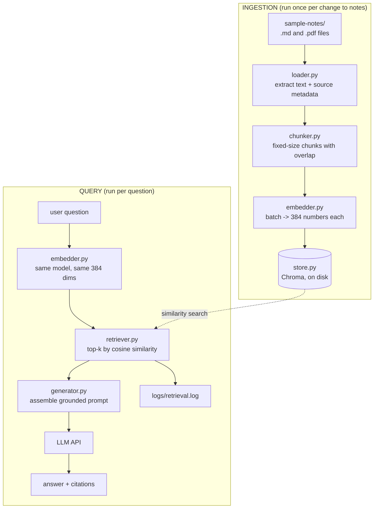

# Design — Ask My Docs

## Overview

A linear pipeline with two entry points. Ingestion runs once per change to the
notes folder; querying runs per question. The two halves meet at the vector
store, and the embedding model is the hinge — the same model must embed both
sides or the similarity scores are meaningless.



The critical invariant: **the embedding model used at query time must be the one
used at ingestion time.** Embeddings from different models are not comparable,
and the failure mode is silent — retrieval returns plausible-looking garbage
rather than an error. Requirement 5.5 exists to turn that silence into a message.

## Components

### `src/embedder.py` — built, Week 1 Mon–Tue

Wraps two providers behind one class so nothing downstream knows which is in use.

```python
class Embedder:
    def __init__(self, backend: str | None = None, model_name: str | None = None)
    def embed(self, text: str) -> list[float]
    def embed_batch(self, texts: list[str]) -> list[list[float]]
    @property
    def dimensions(self) -> int
    def describe(self) -> str          # "local:sentence-transformers/all-MiniLM-L6-v2"
```

Design points:

- The model loads lazily on first embed, not on import, so scripts that only
  print help stay instant.
- `_load_local_model` is `lru_cache`d — one copy of the weights in memory no
  matter how many `Embedder` instances exist.
- `embed_batch` is the primary method; `embed` delegates to it. Batching is
  substantially faster locally and one request instead of N against an API.
- OpenAI responses are re-sorted by the `index` field before returning, because
  ordering is not contractually guaranteed and misaligned vectors would corrupt
  every citation downstream.
- `describe()` exists so logs and README screenshots state which model produced
  the numbers being shown.

### `src/similarity.py` — built, Week 1 Mon–Tue

```python
def cosine_similarity(a, b) -> float
def similarity_matrix(vectors) -> np.ndarray
```

Deliberately hand-written (Requirement 2.1). The division by both magnitudes is
kept even though MiniLM returns normalised output and the dot product alone
would suffice — the explicit form stays correct if the model is swapped for one
that does not normalise, and the arithmetic is the thing being learned.

### `src/loader.py` — Week 1 Wed

```python
@dataclass(frozen=True)
class LoadedDocument:
    source: str            # filename as shown in citations
    path: Path
    text: str
    page: int | None        # set for PDFs, None otherwise

def load_documents(folder: str | Path) -> list[LoadedDocument]
```

PDFs produce one `LoadedDocument` per page rather than one per file. That is what
makes page-level citations possible (Requirement 9.2) without re-deriving page
boundaries from character offsets later.

Per-file failures are collected and reported, never fatal: one unreadable file
out of ten should not abort ingestion.

### `src/chunker.py` — Week 1 Wed

```python
@dataclass(frozen=True)
class Chunk:
    chunk_id: str          # "notes.md#3" — stable, human-readable, citable
    text: str
    source: str
    chunk_index: int
    start_char: int
    page: int | None

def chunk_text(text: str, chunk_size: int, overlap: int) -> list[str]
def chunk_documents(docs: list[LoadedDocument], chunk_size: int, overlap: int) -> list[Chunk]
```

Fixed-size character windows with overlap, advancing by `chunk_size - overlap`.
Overlap is the defence against a fact being severed at a boundary: without it, a
sentence split across two chunks may be retrievable through neither.

Boundary softening (Requirement 4.8): the cut point scans backwards a bounded
distance for a paragraph break, then a sentence end, then whitespace, and falls
back to a hard cut. This stays within the size limit and only ever moves the
boundary earlier, so the advance step remains predictable.

`chunk_id` is a readable composite rather than a UUID specifically so that a
citation in the demo means something to a human watching the video.

### `src/store.py` — Week 2 Mon–Tue

```python
@dataclass(frozen=True)
class StoredMatch:
    chunk: Chunk
    distance: float        # raw Chroma distance, lower is better

class VectorStore:
    def __init__(self, path: str = "chroma_db", collection: str = "notes")
    def reset(self, embedding_model: str, dimensions: int) -> None
    def add_chunks(self, chunks: list[Chunk], embeddings: list[list[float]]) -> int
    def query(self, embedding: list[float], top_k: int) -> list[StoredMatch]
    def count(self) -> int
    def describe_index(self) -> dict
    def embedding_model(self) -> str | None
    def assert_model_matches(self, embedding_model: str) -> None
```

**Built, Week 2 Mon–Tue.** Two deviations from the original sketch:

`query` returns `StoredMatch` (carrying a raw distance) rather than
`RetrievedChunk` (carrying a similarity). `RetrievedChunk` lives in
`retriever.py`, so having the store produce it would invert the dependency.
Keeping distance as far as the store boundary, and converting exactly once in the
retriever, is also what enforces the "every score the user sees points the same
way" rule below.

The pinned version is **`chromadb==1.5.9`**, not 0.5.x. The older line depends on
`chroma-hnswlib`, a C++ extension with no Python 3.12 wheel; pip falls back to
compiling it and fails without Visual Studio build tools. The 1.x line replaced
that binding with a Rust core and ships prebuilt wheels.

Cosine distance is configured explicitly via
`configuration={"hnsw": {"space": "cosine"}}`. Chroma's default is **squared
L2** — measured directly: for perpendicular unit vectors the default reports
distance 2.0 where cosine reports 1.0. For L2-normalised embeddings such as
MiniLM's the two rank identically, so this would not surface as a visible bug
today; it would surface as subtly worse retrieval the moment a non-normalising
model was used. One line to remove the risk.

Embeddings are computed by our own `Embedder` and passed in, rather than letting
Chroma attach its own embedding function. Keeping that boundary visible is the
whole point of Week 1's work.

The producing model name is stored as collection metadata so Requirement 5.5's
mismatch check has something to compare against.

`reset()` deletes and recreates rather than upserting: re-ingestion is cheap at
this scale, and idempotent full rebuilds avoid a class of duplicate-chunk bugs
that are tedious to diagnose.

### `src/retriever.py` — Week 2 Wed–Thu

```python
@dataclass(frozen=True)
class RetrievedChunk:
    chunk: Chunk
    score: float           # cosine similarity, 1.0 = identical direction

class Retriever:
    def __init__(self, store: VectorStore, embedder: Embedder)
    def retrieve(self, question: str, top_k: int = 5, min_score: float | None = None) -> list[RetrievedChunk]
```

Chroma returns *distance*; the retriever converts to similarity (`1 - distance`
for cosine space) so that every number the user sees carries the same meaning as
the Week 1 numbers. Mixing distance and similarity in one project is a reliable
source of confusion.

`min_score` is the mechanism behind Requirement 6.6 — the difference between
"nothing relevant" and "here are the five least irrelevant chunks in your
notes". Its default must be chosen by measurement, not guessed: Week 1 showed
unrelated text scoring around 0.03 and related text around 0.62 for this model,
so the floor belongs somewhere in that gap, validated against real questions.

### `src/generator.py` — Week 3 Mon–Wed

```python
def build_prompt(question: str, chunks: list[RetrievedChunk], char_budget: int) -> tuple[str, list[RetrievedChunk]]
def generate_answer(question: str, chunks: list[RetrievedChunk]) -> Answer
```

`build_prompt` is a pure function returning the prompt string *and* the chunks
that actually fit inside the budget. Purity matters for two reasons: the prompt
can be printed for the demo without calling the API (Requirement 8.6), and
citations are drawn from the chunks that genuinely reached the model rather than
everything retrieved.

Context passages are numbered `[1]`, `[2]`, … and the system prompt instructs
the model to cite those markers. Numbered passages give the model something
precise to point at; "list the files you used" produces vague citations.

The grounding instruction has to give the model an acceptable way out. Told only
"answer from the context", a model under pressure invents something. Told
"if the context does not contain the answer, say so plainly", refusal becomes
the compliant response — which is what makes Requirement 8.4 achievable.

### `scripts/` — the demo surface

| Script | Week | Shows |
| ------ | ---- | ----- |
| `01_embedding_basics.py` | 1 Mon–Tue | one sentence → 384 numbers; similar vs unrelated cosine scores |
| `02_chunking_demo.py` | 1 Wed–Thu | the same document under different size/overlap settings |
| `03_embed_chunks_memory.py` | 1 Fri | every chunk embedded, held in a plain list, searched by hand |
| `04_ingest.py` | 2 Mon–Tue | load → chunk → embed → index into Chroma |
| `05_retrieve.py` | 2 Wed–Fri | a question → top-k chunks with scores; top-k comparison; logging |
| `06_ask.py` | 3 | the full pipeline: question → answer → citations |

Week 1 Friday deliberately builds search over a plain Python list before Chroma
arrives on Monday. Doing the linear scan by hand first is what makes the
database's contribution legible — otherwise "it does similarity search" is a
phrase rather than an understanding.

## Data flow example

A question through the built pipeline:

1. `"What chunk size did I settle on?"` → `Embedder.embed` → 384 numbers
2. `VectorStore.query(embedding, top_k=5)` → Chroma HNSW search → 5 nearest
   chunks with cosine distances
3. `Retriever` converts distance to similarity, applies `min_score`, returns
   `RetrievedChunk` list ordered 0.71, 0.66, 0.51, 0.44, 0.41
4. `build_prompt` numbers them `[1]`–`[5]`, fits them into the character budget
5. LLM answers, citing `[1]` and `[3]`
6. Display resolves those markers to `week1-learning-log.md#4` and
   `week1-learning-log.md#7` with their scores
7. The question and all five retrieved chunks append to `logs/retrieval.log`

## Configuration

All through `.env`, defaults in code, nothing hardcoded at a call site.

| Variable | Default | Notes |
| -------- | ------- | ----- |
| `EMBEDDING_BACKEND` | `local` | `local` or `openai` |
| `LOCAL_EMBEDDING_MODEL` | `sentence-transformers/all-MiniLM-L6-v2` | 384 dims |
| `OPENAI_EMBEDDING_MODEL` | `text-embedding-3-small` | 1536 dims |
| `OPENAI_API_KEY` | — | required for `openai` backend and Week 3 generation |
| `OPENAI_CHAT_MODEL` | `gpt-4o-mini` | answer generation |
| `CHUNK_SIZE` | 500 (provisional) | **to be set by Week 1 Wed–Thu measurement** |
| `CHUNK_OVERLAP` | 100 (provisional) | **to be set by Week 1 Wed–Thu measurement** |
| `TOP_K` | 5 (provisional) | **to be set by Week 2 Wed–Thu measurement** |
| `MIN_SCORE` | none (provisional) | **to be set by Week 3 no-answer testing** |

The four provisional values are the project's actual findings. They are starting
points from the brief, not conclusions, and the README must justify the final
numbers with observations (Requirement 12.3).

## Error handling

Failures split into three kinds, handled differently:

**Configuration errors** — unknown backend, missing API key, folder not found.
Raised immediately with the fix named in the message. No point continuing.

**Per-item data errors** — one unreadable file, one scanned PDF with no text
layer, one whitespace-only chunk. Collected, warned about by name, skipped. One
bad file must not abort an otherwise good ingestion run.

**Runtime errors** — API call failure, empty collection. Reported with the next
action to take: "run `python scripts/04_ingest.py` first" rather than a
`NoneType` traceback.

Scripts catch these at the boundary and return a non-zero exit code with a clean
message (Requirement 10.4). Tracebacks are for bugs, not for expected
conditions.

## Decisions and rationale

**Local embeddings over the OpenAI API by default.** Free, offline after a
one-time 90 MB download, and — most importantly — free to re-run. Week 1
Wed–Thu and Week 2 Wed–Thu both require re-embedding the entire corpus
repeatedly to compare settings. Per-call billing makes a learner hesitate to
experiment, and hesitation is the one outcome this project cannot afford.

**Chroma over LanceDB, FAISS, or Pinecone.** Chroma is recommended in the brief,
runs locally with no signup, and persists to disk in one line. FAISS is faster
at scale but has no metadata store, so citations would need a parallel
bookkeeping layer. Pinecone is managed and needs an account and a network round
trip per query. At a few hundred chunks all of them are instant; the deciding
factor is which one teaches the concept with the least incidental complexity.
The README comparison (Requirement 11.3) should make this argument in the user's
own words.

**Character-based chunking over token-based.** Characters are directly
observable — the user can look at a 500-character chunk and see exactly what it
contains. Token counts require a tokenizer and make the relationship between
"chunk size" and "what I can see on screen" indirect. Token-based chunking is
the better production choice once context limits bind; character-based is the
better teaching choice, and the README should note the difference rather than
pretend it does not exist.

**Fixed-size chunking over semantic chunking.** The brief asks for fixed-size
with overlap. Semantic chunking (splitting on topic shifts) generally retrieves
better but obscures the size/overlap tradeoff that Week 1 is built around. Worth
naming in the README as the obvious next improvement.

**Distance converted to similarity at the retriever boundary.** Chroma speaks
distance, Week 1 taught similarity. Converting once, at the edge, means every
score the user ever sees points the same way: higher is better.

**Numbered context passages.** Enables precise citations and gives the model a
compact way to attribute each claim.

## Things that will go wrong, and the plan

| Symptom | Cause | Response |
| ------- | ----- | -------- |
| Retrieved chunks look random | query embedded with a different model than the index | Requirement 5.5 model-mismatch check on the collection |
| Answer ignores the notes | context buried in a weak prompt, or top-k too high and diluted | print the assembled prompt (8.6); lower top-k |
| Answer invented, notes silent on the topic | prompt gave the model no acceptable refusal | explicit "say so plainly" instruction (8.4) plus `MIN_SCORE` floor |
| A fact is never retrievable | it straddles a chunk boundary | overlap; confirm by locating the fact in `02_chunking_demo.py` output |
| Citations point at the wrong passage | chunks reordered, or cited chunks not the ones that fit the budget | `build_prompt` returns the fitted chunks it actually used |
| Scanned PDF contributes nothing | no text layer, OCR out of scope | warn by name at load time (3.4) |
| Model download stalls | connection drops; 10 s HF read timeout too short | `HF_HUB_DOWNLOAD_TIMEOUT=120`, background download, poll cache size |

## Verification approach

No test suite — the brief does not ask for one and adding it unprompted spends
Week 3 time that belongs to the README and the video. Verification is by running
each script and inspecting its output, which is exactly what the mentor will do.

The substantive checks are empirical and belong in the learning log:

- similar sentences must outscore unrelated ones by a visible margin — **done,
  0.617 vs 0.031**
- a fact known to sit in the notes must be retrievable by a question that shares
  no keywords with it
- a question with no answer in the notes must produce a refusal, not a fabrication
- every displayed citation must point at a passage that genuinely contains the
  claim, verified by opening the source file
