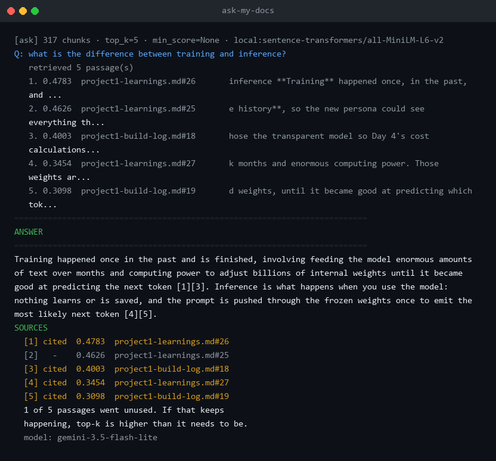
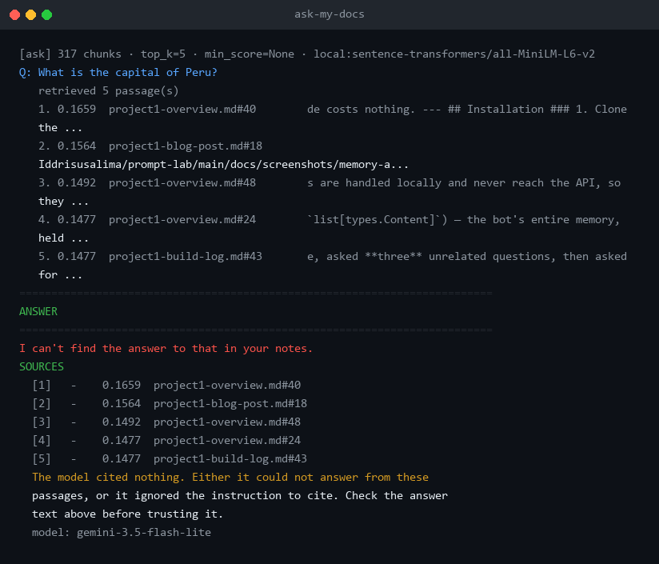
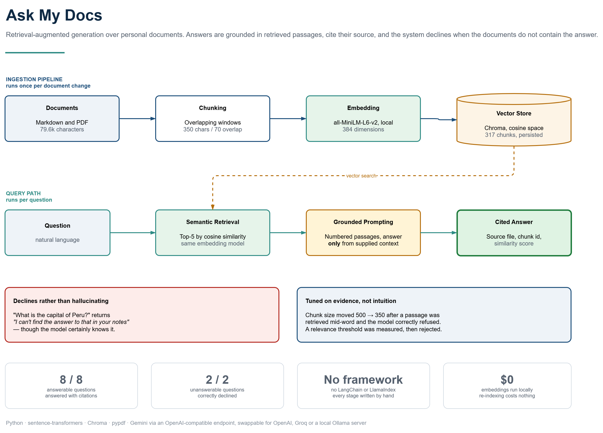

# Ask My Docs

[](https://github.com/Iddrisusalima/ask-my-docs/actions/workflows/ci.yml)
[](https://www.python.org/downloads/)
[](LICENSE)
[](https://www.sbert.net/)
[](https://ai.google.dev/)
[](#deliberately-out-of-scope)

A command-line tool that answers questions about your own notes, using only
passages retrieved from those notes rather than a language model's general
knowledge. Ask a question in plain English and it returns an answer with a
citation naming the file and passage it came from — and when your notes do not
contain the answer, it says so instead of inventing one. The goal was not just a
working question-answering tool but understanding every stage, so chunking,
embedding, similarity, storage, retrieval and prompt assembly are each written
out by hand with no RAG framework involved.

---

## Table of contents

- [Demo](#demo)
  - [When the notes do not contain the answer](#when-the-notes-do-not-contain-the-answer)
- [Architecture](#architecture)
  - [Components](#components)
  - [One question, end to end](#one-question-end-to-end)
  - [Three design decisions worth stating](#three-design-decisions-worth-stating)
- [Project layout](#project-layout)
- [Prerequisites](#prerequisites)
- [Installation](#installation)
  - [1. Clone the repository](#1-clone-the-repository)
  - [2. Create a virtual environment](#2-create-a-virtual-environment)
  - [3. Install dependencies](#3-install-dependencies)
  - [4. Add your API key](#4-add-your-api-key)
  - [5. Index the notes](#5-index-the-notes)
  - [6. Ask something](#6-ask-something)
- [Usage](#usage)
  - [Inspecting each stage](#inspecting-each-stage)
  - [Command line flags](#command-line-flags)
  - [Using your own documents](#using-your-own-documents)
- [Key concepts](#key-concepts)
- [Settings, and why](#settings-and-why)
  - [Why the chunk size changed from 500 to 350](#why-the-chunk-size-changed-from-500-to-350)
- [Verification](#verification)
  - [Automated](#automated)
  - [Measured answer quality](#measured-answer-quality)
  - [Manual failure injection](#manual-failure-injection)
- [What I Learned](#what-i-learned)
- [Deliberately out of scope](#deliberately-out-of-scope)
- [Documentation](#documentation)
- [License](#license)

---

## Demo

> **DEMO VIDEO** — _to be recorded._
>
> A run through the tool covering ingestion, two or three live questions, what
> happens at each stage of the pipeline, and the behaviour when a question has no
> answer in the notes.



The dataset is five of my own write-ups from a previous project — 79,581
characters of markdown, committed to `sample-notes/` so the tool can be run
without supplying your own documents.

Two things in that screenshot are worth more than the answer itself. The
`cited` markers show which passages the model actually leaned on, not merely
which were offered — one of the five went unused, and when that keeps happening
it means top-k is set higher than it needs to be. And every citation resolves to
a real file and chunk, so any claim can be checked against the source in seconds.

### When the notes do not contain the answer



This is the behaviour worth testing first on any RAG tool. The model certainly
knows the capital of Peru — it declines because the answer is not in the
retrieved passages. Note the scores: nothing clears 0.17, and no passage is
cited. Verified separately with *"how do I fix a leaking radiator?"*, which also
declines.

Getting this right took more than an instruction. A question with no answer in
the notes still scored **0.339**, while the weakest genuinely useful answer
scored **0.366** — a gap of 0.027. No score threshold separates those reliably,
so the relevance floor ships switched off and the prompt carries the weight
instead.

---

## Architecture

The pipeline has two halves that meet at the vector store. **Ingestion** runs
once, and again whenever the notes change: documents are read, cut into
overlapping chunks, embedded, and indexed. **Querying** runs per question: the
question is embedded with the same model, the nearest chunks come back, and those
passages — and only those — are handed to a language model.



The embedding model appears on both sides, and **it must be the same one**.
Embeddings from two different models are not comparable, but querying across them
raises no error — it returns confident, well-formed, meaningless results. The
store records which model built it and refuses a mismatch, turning the project's
quietest failure into a message.

### Components

- **Document loader** (`src/loader.py`) — reads `.md`, `.txt` and `.pdf` from a
  folder, recursing into subfolders. PDFs produce one document *per page*, so
  page numbers survive into citations. A single unreadable file warns by name and
  is skipped rather than aborting the run.
- **Chunker** (`src/chunker.py`) — fixed-size character windows with overlap. Cut
  points scan backwards a bounded distance for a paragraph break, then a sentence
  ending, then any whitespace, so a chunk never ends mid-word.
- **Embedder** (`src/embedder.py`) — wraps a local Sentence Transformers model and
  any OpenAI-compatible API behind one interface, chosen by a single environment
  variable. Loads lazily and batches by default.
- **Similarity** (`src/similarity.py`) — cosine similarity written from first
  principles: dot product divided by both magnitudes. Deliberately not imported.
- **Vector store** (`src/store.py`) — a persistent Chroma collection, cosine space
  set explicitly, recording which model built it.
- **Retriever** (`src/retriever.py`) — embeds the question, returns the top-k
  nearest chunks, and converts Chroma's *distance* into *similarity* exactly once
  so every score downstream means higher-is-better.
- **Generator** (`src/generator.py`) — assembles the grounded prompt as a pure
  function, numbers the passages, and calls the chat model.
- **Retrieval log** (`src/retrieval_log.py`) — appends every question, its full
  configuration and every score to a file, so quality can be reviewed later
  rather than scrolling past.
- **Config** (`src/config.py`) — the four tuned settings, read from `.env` in one
  place so a documented value cannot drift from the one actually used.

### One question, end to end

The question is embedded by the same model that built the index — checked before
the first query, because a mismatch produces no error. Chroma returns the five
nearest chunks as distances; the retriever converts them to similarities and
sorts. Those passages are numbered `[1]` to `[5]` and assembled into a prompt
that instructs the model to answer **only** from them, to cite the numbers it
used, and to say plainly if the passages do not contain the answer. The model
replies, the cited numbers are resolved back to filenames and chunk ids with
their scores, and the whole exchange is appended to `logs/retrieval.log`. If
nothing clears the relevance floor the pipeline stops before the model is called
at all, because handing over empty context would only invite invention.

### Three design decisions worth stating

- **Prompt assembly is a pure function.** `build_prompt()` takes a question and
  passages and returns a string, touching nothing else. That is what makes
  `--show-prompt` possible — the exact text can be printed without spending an
  API call — and it is why citations are drawn from the passages that genuinely
  fitted the character budget rather than everything retrieved.
- **The model is given permission to refuse.** Told only *"answer from the
  context"*, a model handed irrelevant passages still produces something, because
  refusing is not an option it has. Told *"if the passages do not contain the
  answer, say so plainly"*, refusal becomes the compliant response.
- **Distance becomes similarity at one boundary.** Chroma speaks distance, where
  lower is better. The rest of the project speaks similarity, where higher is
  better. Both are defensible; having both alive in one codebase is not.

---

## Project layout

```text
scripts/
  embeddings.py          Stage 1: one sentence becomes 384 numbers; similar
                         sentences scored against unrelated ones
  chunking.py            Stage 2: what overlap duplicates, and a fact lost
                         entirely at a hard boundary
  search_in_memory.py    Stage 3: a working search with no database at all —
                         a plain list and a for loop
  ingest.py              Stage 4: load, chunk, embed, index into Chroma
  retrieve.py            Stage 5: retrieval scores, top-k comparison, the
                         relevance-floor sweep
  ask.py                 Stage 6: the full pipeline, question to cited answer

src/
  loader.py              Read .md .txt .pdf, keep filename and page number
  chunker.py             Fixed-size chunks with overlap and softened boundaries
  embedder.py            Text to embeddings, local or OpenAI-compatible
  similarity.py          Cosine similarity, written by hand
  store.py               Chroma wrapper, cosine space, model-mismatch guard
  retriever.py           Question to top-k passages with similarity scores
  generator.py           Grounded prompt assembly, answer, citations
  retrieval_log.py       Append questions, settings and scores to a file
  config.py              The tuned settings, read from .env
  console.py             UTF-8 output, so a dash cannot crash a script

requirements.txt         Pinned dependencies
.env.example             Template for environment variables (tracked)
.env                     Your real API key (git-ignored, never committed)
.gitignore               Excludes .env, venv/, chroma_db/, logs/, caches

README.md                This file
notes/
  learning-log.md        Every measurement, by pipeline stage, including the
                         things I got wrong and had to change
sample-notes/            The committed test dataset — five of my own write-ups
docs/
  architecture-overview.drawio   Editable source for the diagram above
  architecture.drawio            One question end to end, with the measurements
  screenshots/                   Generated terminal sessions plus transcripts
presentation/
  build_deck.py          Generates the mentor review deck
  render_terminal.py     Runs each session and renders it as a PNG
  presentation-script.md What to say for each slide
.kiro/
  specs/ask-my-docs/     Requirements, design and tasks, written before the code
  steering/              Project conventions and learning constraints
  hooks/                 Automation run by the editor
.github/
  workflows/ci.yml       CI: byte-compiles every module across 3.11 and 3.12
```

`scripts/ask.py` is the only file you need to run. The five earlier scripts are
kept deliberately: each isolates one stage and shows how the tool was built.
`search_in_memory.py` in particular implements the whole search with a Python
list and a `for` loop, before any database is involved.

---

## Prerequisites

| Requirement | Details |
| --- | --- |
| **Python** | 3.11 or newer. Developed on 3.12.5, CI tests 3.11 and 3.12. |
| **API key** | Free from [Google AI Studio](https://aistudio.google.com/apikey). No payment method needed. Only used for answer generation — embeddings run locally. |
| **Disk** | About 500 MB for dependencies and the embedding model, downloaded once. |
| **Git** | Only needed to clone the repository. |
| **OS** | Cross-platform. Developed on Windows 11 (PowerShell), CI runs on Ubuntu. |

Embeddings run on your own machine, so re-indexing costs nothing. That is what
made the chunk-size experiments possible — paying per call makes you reluctant to
re-run them.

---

## Installation

### 1. Clone the repository

```bash
git clone https://github.com/Iddrisusalima/ask-my-docs.git
cd ask-my-docs
```

### 2. Create a virtual environment

<details open>
<summary><b>Windows (PowerShell)</b></summary>

```powershell
python -m venv venv
venv\Scripts\Activate.ps1
```

</details>

<details>
<summary><b>macOS / Linux (Bash)</b></summary>

```bash
python3 -m venv venv
source venv/bin/activate
```

</details>

> **Note for Windows users:** if activation is blocked by execution policy, run
> `Set-ExecutionPolicy -Scope Process -ExecutionPolicy Bypass` first. Alternatively
> skip activation entirely and call the interpreter directly with
> `venv\Scripts\python.exe` in place of `python`.

### 3. Install dependencies

```bash
pip install -r requirements.txt
```

This pulls in PyTorch for the local embedding model, so it is the slow step. The
model itself downloads on first use, about 90 MB, and is cached after that.

### 4. Add your API key

```bash
cp .env.example .env
```

On Windows PowerShell:

```powershell
Copy-Item .env.example .env
```

Then open `.env` and fill in the three values for answer generation:

```ini
OPENAI_API_KEY=your_real_key_here
OPENAI_BASE_URL=https://generativelanguage.googleapis.com/v1beta/openai/
OPENAI_CHAT_MODEL=gemini-3.5-flash-lite
```

Any OpenAI-compatible provider works — `.env.example` also documents OpenAI
itself, Groq, and a local Ollama server. `.env` is listed in `.gitignore`, so your
key stays on your machine and cannot be committed. Only `.env.example`, which
holds no real values, is tracked.

### 5. Index the notes

```bash
python scripts/ingest.py --folder sample-notes
```

Run this first, and again whenever the notes change. It rebuilds the collection
from scratch, so running it twice leaves no duplicates.

### 6. Ask something

```bash
python scripts/ask.py --question "what is a context window measured in?"
```

Or interactively, which is what the demo uses:

```bash
python scripts/ask.py
```

<details>
<summary><b>Windows: fixing mangled characters</b></summary>

If arrows and em-dashes from your notes appear as `ΓÇö`, your console is using the
wrong codepage. Run this once per session:

```powershell
[Console]::OutputEncoding = [System.Text.Encoding]::UTF8
```

</details>

---

## Usage

### Inspecting each stage

Every stage runs on its own and narrates what it is doing. This is how the tool
was built and how it is demonstrated.

| Script | What it shows |
| --- | --- |
| `scripts/embeddings.py` | One sentence becomes 384 numbers. Related sentences score 0.617 against each other; unrelated ones 0.031. |
| `scripts/chunking.py` | What overlap duplicates, and a planted fact that a hard 500-character cut leaves in **no chunk at all**. |
| `scripts/search_in_memory.py` | A complete semantic search with no database — a list and a `for` loop — plus the timings that justify adding one. |
| `scripts/ingest.py` | Load, chunk, embed, index. Also measures the approximate index against an exact scan. |
| `scripts/retrieve.py` | Retrieval scores, the top-k tradeoff, and the relevance-floor sweep. |
| `scripts/ask.py` | The full pipeline, and `--show-prompt` to print the exact prompt without calling the API. |

### Command line flags

| Flag | What it does |
| --- | --- |
| `--question "..."` | Ask one question and exit. Repeatable. |
| `--show-prompt` | Print the assembled prompt and stop, calling no API. |
| `--top-k N` | Override `TOP_K` for this run. |
| `--min-score N` | Apply a similarity floor, `0.0` to `1.0`. |
| `--folder PATH` | Point ingestion at a different folder. |
| `--chunk-size N` / `--overlap N` | Override chunking for an experiment. |
| `--no-log` | Skip writing to `logs/retrieval.log`. |
| `--help` | Show all flags for that script. |

`--show-prompt` is the one worth knowing about. *"The model only sees my notes"*
is a claim; the printed prompt is evidence.

### Using your own documents

1. Put `.md`, `.txt` or `.pdf` files in `sample-notes/`, or any folder you like.
2. Re-run ingestion with `--folder` pointing at it.
3. Ask away.

Scanned PDFs contain images rather than text. Those are reported by name and
skipped, since OCR is out of scope.

---

## Key concepts

Short version here. Every measurement behind these, including the experiments
that changed my mind, is in **[`notes/learning-log.md`](notes/learning-log.md)**.

**Embeddings** turn a piece of text into a fixed-length list of numbers
positioned so that similar meanings land near each other. Two properties drive
everything downstream. The length never changes — 7 characters and 196 characters
both produce 384 numbers — which is why a whole document averaged into one
position matches nothing sharply. And the numbers only mean anything relative to
others from the *same model*.
→ [Read more](notes/learning-log.md#1-embeddings-and-similarity)

**Chunking** splits documents so retrieval can return a passage rather than a
file. The measurement that mattered: a 73-character fact planted across a
500-character boundary ended up in **no chunk at all** — present in the document,
retrievable through neither half, with nothing reporting a problem.
→ [Read more](notes/learning-log.md#2-loading-and-chunking)

**Semantic search** compares meaning rather than words. Two sentences about
weekend baking scored 0.618 against each other while sharing no useful words; a
keyword baseline on the same corpus returned three results tied at exactly
0.2857, meaning it could not rank them at all.
→ [Read more](notes/learning-log.md#3-search-with-no-database)

**Vector databases** index embeddings so search does not compare against
everything. The counterintuitive part: Chroma's index is *approximate* — it skips
comparisons deliberately — so it is **less** accurate than the brute-force loop it
replaces, and far more scalable. It agreed with the exact scan 10/10 here, which
is expected at 317 chunks rather than proof the approximation is free.
→ [Read more](notes/learning-log.md#4-the-vector-database)

**Grounded generation** is the stage where a correct retrieval can still produce
a wrong answer, because nothing in the plumbing stops the model replying from its
own knowledge. Only the prompt does.
→ [Read more](notes/learning-log.md#7-grounded-generation)

---

## Settings, and why

All configurable in `.env`. Every value was chosen by measurement, recorded in
the learning log.

| Setting | Value | Reasoning |
| --- | --- | --- |
| `CHUNK_SIZE` | 350 | First set to 500 from chunk-count statistics, then changed after testing real answer quality — see below. |
| `CHUNK_OVERLAP` | 70 | 20% of chunk size. Overlap is what stops a fact being lost when a cut lands mid-sentence. |
| `TOP_K` | 5 | k=3 pulled from only 2.5 documents on average; k=10 cost 3.4x the context for a 0.06 drop in mean relevance and wasted nearly 3 of 10 slots on overlapping neighbours. |
| `MIN_SCORE` | unset | A floor high enough to reject an unanswerable question also stripped real answers from weaker ones. The prompt handles refusal instead. |
| Embedding model | `all-MiniLM-L6-v2` | 384 dimensions, local, free. Re-embedding the whole corpus costs nothing, which is what made these experiments possible. |

### Why the chunk size changed from 500 to 350

Two questions my notes clearly answer were refused at 500/100, and diagnosing
them was the most useful thing in the project.

**A passage arrived mid-word.** Asked why input and output tokens are priced
differently, retrieval returned a passage beginning `y 8x more per token than` —
that is *"...roughly 8x"* with its opening sliced into the neighbouring chunk. The
model received an incoherent fragment and declined. At top-k 10 the complete
sentence still never appeared: no chunk contained it whole.

**A short section was diluted.** My notes answer *"how did I keep my API key
safe"* in four numbered steps under a heading of almost exactly that name. At 900
characters that eight-line section is absorbed into a chunk dominated by
unrelated material, and its embedding stops matching the question.

| Setting | Token pricing question | Key safety question |
| --- | --- | --- |
| 500 / 100 | refused — mid-word fragment | refused |
| 900 / 300 | correct partial answer | refused — diluted |
| **350 / 70** | fine | **answered** |

These notes are written in short sections with frequent headings, and ~350
characters maps to roughly one section. Longer flowing prose would want larger
chunks — the right value is a property of the documents, not a universal constant.

---

## Verification

Every failure below was deliberately triggered and the behaviour observed, not
merely coded for and assumed.

### Automated

CI runs on every push across Python 3.11 and 3.12. It byte-compiles every module
and script, confirms all nine `src` modules are present, and checks each script
declares the `sys.path` bootstrap it needs to run from the project root. It
installs no dependencies and makes no API calls, so it needs no secrets and costs
nothing.

```bash
python -m compileall -q src scripts presentation
```

### Measured answer quality

Ten questions at the final settings, against the committed dataset:

| Result | Count |
| --- | --- |
| Answerable questions answered with correct citations | **8 / 8** |
| Unanswerable questions correctly declined | **2 / 2** |

Every citation was checked by opening the source file and confirming the claim is
actually there. One answer was partial — it recovered one of four numbered steps —
and that is recorded rather than rounded up. The full table, with each question
and its verdict, is in
[`notes/learning-log.md`](notes/learning-log.md#9-testing-and-refinement).

This is a small sample on a small corpus, and I wrote the questions. It is a real
result, not a benchmark.

### Manual failure injection

| Failure | How it was forced | Behaviour |
| --- | --- | --- |
| Folder does not exist | Passed a nonsense `--folder` | Reports the resolved path it tried, exit code 1 |
| Folder has no documents | Pointed at an empty directory | Names the extensions it accepts, exit code 1 |
| Querying before indexing | Deleted `chroma_db/` | Names the ingestion command to run |
| Index built by another model | Asserted a mismatched model name | Refuses, naming both models |
| No API key | Emptied `OPENAI_API_KEY` | Explains the options and suggests `--show-prompt` |
| PDF with no text layer | A scanned PDF | Warns by name, skips it, continues with the rest |
| File that is not valid UTF-8 | A mis-encoded file | Warns by name, skips it, continues |
| `overlap` ≥ `chunk_size` | Set both to 500 | Rejected with an explanation of why it cannot advance |
| Nothing clears the floor | Asked about Peru with `--min-score 0.5` | Says so rather than answering from noise |
| Non-ASCII in a note | An em dash on a cp1252 console | Fixed at the source: output is forced to UTF-8 |

Two principles behind this.

**A silent failure is worse than a loud one.** The model-mismatch guard exists
because that failure has no symptom — you get confident, well-formed, meaningless
answers. Recording which model built the collection turns silence into a message.

**One bad file must not abort a good run.** An unreadable file out of ten warns
by name and is skipped, because the other nine are still worth indexing.

---

## What I Learned

### What an embedding is

An embedding is what you get when a model reads a piece of text and turns it into
a position on a map of meaning. Text that means similar things lands in nearby
positions, even when the words are completely different. Nobody designed that map
and nobody chose what each number stands for — the model worked the layout out
during training, from an enormous amount of text, by learning which words and
phrases turn up in similar situations. So a single number on its own tells you
nothing. What carries the information is how close two pieces of text end up to
each other.

The measurement that made this click for me: *"I bake sourdough bread every
weekend"* and *"Most Saturdays you will find me making a loaf from scratch"*
scored **0.618** against each other. Those two sentences share no useful words at
all. A keyword search scores that pair near nothing.

Two properties matter more than they first appear. The output length never
changes — 7 characters in and 196 characters in both come back as exactly 384
numbers. And the numbers are only comparable to others from the same model, which
is why my vector store records which model built it and refuses to answer if a
different one asks.

### Why splitting documents into chunks matters

Two reasons, and they push the same way.

First, because that output length is fixed. A whole document gets squeezed into
the same amount of space as a single sentence, so everything it discusses is
averaged into one position. A file covering five topics ends up in the bland
middle of all five and matches none of them sharply.

Second, retrieval should hand the model the paragraph that answers the question,
not the file that contains it. Everything else in that file is noise: it costs
money, fills up the context window, and pulls the model's attention away from the
part that actually matters.

But chunking creates its own failure, and this was the most useful thing I found.
I planted a 73-character fact so a 500-character cut would land in the middle of
it. Half went into one chunk, half into the next, and **no chunk contained it
whole**. The fact was in my notes and my tool could not find it — with no error
reported anywhere. Overlap fixes that: each chunk repeats the last stretch of the
one before, so any short fact survives intact somewhere.

### What semantic search means

Semantic search looks for text that *means* the same thing as your question,
rather than text that uses the same words. When I ask my notes a question, the
tool is not scanning for keywords — it works out where the question sits on that
map of meaning, then returns the passages sitting closest to it.

My own numbers showed the difference plainly. Sentences about one topic scored
0.617 against each other while unrelated ones scored 0.031. And on a question
phrased to avoid the vocabulary of its own answer, a keyword baseline returned
three results tied at exactly 0.2857 — it had found the same shallow word-hit
count everywhere and could not rank them at all. Semantic search produced
distinct, ordered scores.

The honest limit: closeness in meaning is not the same as answering the question.
Asking about *Sundays* pulled up a chunk containing *"Sun Oct 4"* from a schedule.
The model was right that those are related. It has no idea whether being related
is useful.

### The pipeline, end to end

Five stages: **chunk, embed, store, retrieve, generate.**

My documents get cut into overlapping 350-character pieces. Each piece is turned
into 384 numbers and stored in a database that can search by closeness. When I ask
a question, the question is turned into 384 numbers by the *same* model, the
database returns the five closest pieces, and those pieces — and nothing else —
are put into a prompt that tells the model to answer only from them and to say so
if they do not contain the answer. The answer comes back with numbers pointing at
which pieces it used, and those resolve to real filenames I can open and check.

Ingestion runs once per change to my notes. The query path runs per question.

### Chroma versus Pinecone

I used Chroma. It runs inside my own process, persists to a folder on disk, needs
no account and no network call, and installed in one line. For a few hundred
chunks on one machine that is all upside.

Pinecone is a managed service. It scales past a single machine and needs no local
resources, but it requires an account and an API key, and every query becomes a
network round trip. FAISS was the third option I looked at: faster at large scale,
but it stores no metadata, so I would have had to build and keep in sync a
parallel store just to know which file each embedding came from — and citations
are the whole point of this tool.

At 317 chunks all three would return the same answers. The deciding factor was
which one taught me the concept with the least incidental complexity, and which
one a reviewer could run without signing up for anything.

### When RAG is the right tool, and when it is not

RAG is right when the model needs facts it was never trained on — my own notes,
a company's internal documents, anything that changes often. Adding a document is
just re-running ingestion, and because answers cite their source I can verify
them.

Fine-tuning changes how a model behaves rather than what it knows: tone, format,
following a particular style of instruction. It is expensive, needs retraining
whenever the information changes, and the result cannot tell you where an answer
came from. For *"what did I write about chunk size?"*, RAG is obviously the right
tool. For *"always reply as a terse code reviewer"*, fine-tuning would be.

### Two things I got wrong

**I assumed a vector database would be more accurate than my own code.** In the
week before adding Chroma I wrote the whole search as a Python list and a `for`
loop comparing against every chunk. That version is *exact* — it cannot miss a
match. Chroma's index is approximate; it skips comparisons on purpose. So the
database is less accurate than the loop it replaced, and vastly more scalable. I
had the trade backwards.

**I thought a score threshold could catch unanswerable questions.** Early on,
related text scored 0.617 and unrelated text 0.031, so a cut-off looked obvious.
Against a real corpus the gap collapsed: a question my notes cannot answer scored
0.339, while the weakest genuinely useful answer scored 0.366. I then tested a
floor across four questions and found that any value which silenced the bad
question also stripped real answers from the weaker ones. The threshold ships
switched off, and the prompt — which explicitly permits the model to refuse —
carries that job instead.

---

## Deliberately out of scope

Named here because knowing what was left out matters as much as what was built: a
web interface, OCR for scanned PDFs, reranking models, hybrid keyword and
semantic search, conversational follow-up memory, and incremental re-indexing of
only the files that changed.

No RAG framework either — no LangChain, no LlamaIndex. That was the point. A
framework would have done the first week in about four lines, and I would not be
able to explain any of them.

Semantic chunking — splitting on topic shifts rather than character counts —
would likely retrieve better than fixed-size chunks and is the most obvious next
improvement.

---

## Documentation

| Document | Contents |
| --- | --- |
| [`notes/learning-log.md`](notes/learning-log.md) | Every measurement behind the project, by pipeline stage: similarity scores, the chunk-size experiments, top-k tuning, the relevance-floor finding, and the ten-question quality test. Includes what I got wrong and had to change. |
| [`docs/screenshots/`](docs/screenshots) | Generated terminal sessions, each with the transcript it was drawn from. Regenerate with `python presentation/render_terminal.py`. |
| [`docs/architecture.drawio`](docs/architecture.drawio) | One question end to end, with the measurement behind each design choice. Editable in [draw.io](https://app.diagrams.net). |
| [`.kiro/specs/ask-my-docs/`](.kiro/specs/ask-my-docs) | Requirements, design and task breakdown, written before the code. |
| [`presentation/`](presentation) | Review deck, the script that generates it, and the speaking notes behind it. |

The documents in [`sample-notes/`](sample-notes) are my own write-ups from a
previous project, committed so the tool can be run without supplying your own.

---

## License

Released under the [MIT License](LICENSE)
