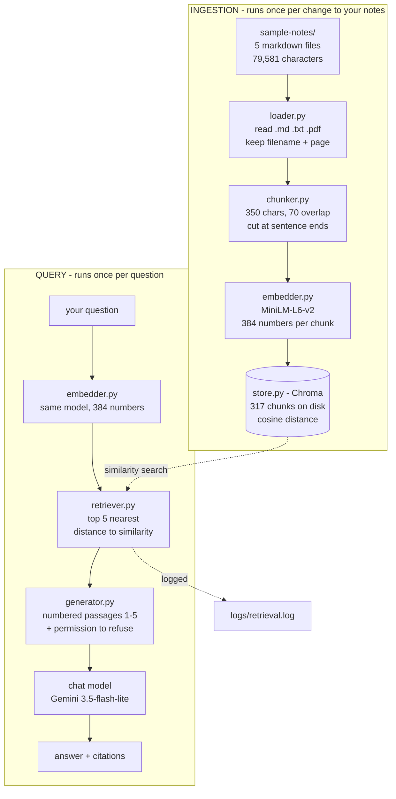

# Ask My Docs

A command-line tool that answers questions about your own notes, using only
passages retrieved from those notes rather than a language model's general
knowledge. Point it at a folder of markdown or PDF files, ask a question in plain
English, and it returns an answer with a citation telling you which note and
which passage it came from — and says so plainly when your notes do not contain
the answer.

Built manually, stage by stage, with no RAG framework. Every step — chunking,
embedding, similarity, storage, retrieval, prompt assembly — is written out and
can be inspected and run on its own.

**Dataset in this repository:** `sample-notes/` holds five of my own write-ups
from Project 1, about prompt engineering and token economics — 79,581 characters,
which becomes 317 chunks. They are committed so the tool can be run without
supplying your own documents.

---

## How it works



Ingestion runs once, when the notes change. The query side runs per question. The
embedding model appears on both sides and **must be the same one** — embeddings
from different models are not comparable, and comparing them raises no error, it
just returns confident nonsense. The store records which model built it and
refuses a mismatch.

---

## Setup

Requires Python 3.12 and about 500 MB of disk for the embedding model and
dependencies.

```powershell
git clone https://github.com/<your-username>/ask-my-docs.git
cd ask-my-docs

python -m venv venv
.\venv\Scripts\python.exe -m pip install -r requirements.txt
```

On macOS or Linux use `venv/bin/python` in place of `.\venv\Scripts\python.exe`.

### Configure

```powershell
Copy-Item .env.example .env
```

Embeddings run locally by default and need no API key. The model downloads once,
about 90 MB, on first use.

Answer generation needs a chat model. Any OpenAI-compatible provider works —
`.env.example` documents Gemini, OpenAI, Groq and a local Ollama server. This
project was developed against Gemini's OpenAI-compatible endpoint:

```
OPENAI_API_KEY=your-gemini-key
OPENAI_BASE_URL=https://generativelanguage.googleapis.com/v1beta/openai/
OPENAI_CHAT_MODEL=gemini-3.5-flash-lite
```

A free Gemini key is available from [Google AI Studio](https://aistudio.google.com/apikey).

`.env` is gitignored. Never commit it.

### Run

```powershell
# index the notes - do this first, and again whenever the notes change
.\venv\Scripts\python.exe scripts\04_ingest.py --folder sample-notes

# ask a question
.\venv\Scripts\python.exe scripts\06_ask.py --question "what is a context window measured in?"

# or interactively
.\venv\Scripts\python.exe scripts\06_ask.py
```

On Windows, run this once per terminal session so that arrows and dashes in your
notes do not crash the output:

```powershell
[Console]::OutputEncoding=[Text.Encoding]::UTF8
```

### Use your own documents

1. Put `.md`, `.txt` or `.pdf` files in `sample-notes/`, or any folder you like.
2. Re-run ingestion, pointing `--folder` at it.
3. Ask away.

Re-ingesting rebuilds the collection from scratch, so running it twice is safe
and leaves no duplicates. Scanned PDFs contain images rather than text; those are
reported by name and skipped, since OCR is out of scope.

---

## Example

Real output, unedited:

```
$ .\venv\Scripts\python.exe scripts\06_ask.py --question "what is the difference between training and inference?"

[ask] 317 chunks · top_k=5 · min_score=None · local:sentence-transformers/all-MiniLM-L6-v2

Q: what is the difference between training and inference?
   retrieved 5 passage(s)
   1. 0.4783  project1-learnings.md#26       inference **Training** happened once, in the past, and ...
   2. 0.4626  project1-learnings.md#25       e history**, so the new persona could see everything th...
   3. 0.4003  project1-build-log.md#18       hose the transparent model so Day 4's cost calculations...
   4. 0.3454  project1-learnings.md#27       k months and enormous computing power. Those weights ar...
   5. 0.3098  project1-build-log.md#19       d weights, until it became good at predicting which tok...

==========================================================================
ANSWER
==========================================================================
Training happened once in the past and is finished, involving feeding the model
enormous amounts of text over months and computing power to adjust its weights
until it predicts the next token well [1][3]. Inference is what happens when the
model is used; nothing learns or is saved as the prompt is pushed through the
frozen weights to emit the next token [4][5].

SOURCES
  [1] cited  0.4783  project1-learnings.md#26
  [2]   -    0.4626  project1-learnings.md#25
  [3] cited  0.4003  project1-build-log.md#18
  [4] cited  0.3454  project1-learnings.md#27
  [5] cited  0.3098  project1-build-log.md#19

  1 of 5 passages went unused. If that keeps
  happening, top-k is higher than it needs to be.

  model: gemini-3.5-flash-lite
```

Passages marked `cited` are the ones the model actually referenced; `-` means
offered and unused. That distinction is worth having — if most passages go unused
across many questions, top-k is higher than it needs to be.

Two things in this output are worth noticing rather than hiding. The previews
start mid-sentence because chunks are cut at fixed character counts, so a preview
of the first 58 characters often begins part-way through a word. And passage [3]
has a preview about cost calculations, yet the model cited it — the relevant text
is further into that chunk than the preview shows. Previews are for skimming, not
for judging relevance.

### When the notes do not contain the answer

```
Q: What is the capital of Peru?
   retrieved 5 passage(s)

ANSWER
I can't find the answer to that in your notes.
```

This is the behaviour worth testing first on any RAG tool. The model certainly
knows the capital of Peru — it refuses because the answer is not in the retrieved
passages. Verified separately with "how do I fix a leaking radiator?", which also
refuses.

---

## Settings, and why

All configurable in `.env`. Every value below was chosen by measurement, recorded
in `notes/`.

| setting | value | reasoning |
| ------- | ----- | --------- |
| `CHUNK_SIZE` | 350 | Week 1 chose 500 from chunk-count statistics. Week 3 tested real answer quality and changed it — see below. |
| `CHUNK_OVERLAP` | 70 | 20% of chunk size. Overlap is what stops a fact being lost when a cut lands mid-sentence. |
| `TOP_K` | 5 | k=3 pulled from too few documents; k=10 cost 3.4x the context for a 0.06 drop in mean relevance and wasted ~3 of 10 slots on overlapping neighbours. |
| `MIN_SCORE` | unset | A floor high enough to reject an unanswerable question also stripped real answers from weaker questions. The prompt handles refusal instead. |
| embedding model | `all-MiniLM-L6-v2` | 384 dimensions, local, free. Re-embedding the whole corpus costs nothing, which is what made the chunk-size experiments possible. |

### Why the chunk size changed from 500 to 350

Two questions my notes clearly answer were refused at 500/100, and diagnosing
them was the most useful thing in the project.

**A passage arrived mid-word.** Asked why input and output tokens are priced
differently, retrieval returned a passage beginning `y 8x more per token than` —
that is "...roughl**y 8x**" with its opening sliced into the neighbouring chunk.
The model received an incoherent fragment and refused. At top-k 10 the complete
sentence still never appeared: no chunk contained it whole.

**A short section was diluted.** My notes answer "how did I keep my API key safe"
in four numbered steps under a heading of almost exactly that name. At 900
characters that eight-line section is absorbed into a chunk dominated by
unrelated material, and its embedding stops matching the question.

| setting | token pricing question | key safety question |
| ------- | ---------------------- | ------------------- |
| 500 / 100 | refused — mid-word fragment | refused |
| 900 / 300 | correct partial answer | refused — diluted |
| **350 / 70** | fine | **answered** |

These notes are written in short sections with frequent headings, and ~350
characters maps to roughly one section. Longer flowing prose would want larger
chunks — the right value is a property of the documents, not a universal
constant.

### Measured answer quality

Ten questions at the final settings: **8 of 8 answerable questions answered with
correct citations, 2 of 2 unanswerable questions refused.** Each citation was
checked by opening the source file. The full table is in
`notes/learning-log.md`.

---

## What I Learned

> **TO BE WRITTEN — this section must be in my own words.**
>
> It needs to cover, in plain language:
>
> - what an embedding is, without using "vector" as a cop-out
> - why splitting documents into chunks matters
> - what semantic search means
> - the RAG pipeline end to end
> - how Chroma compares to one alternative
>
> The measurements to draw on are in `notes/learning-log.md`,
> `notes/learning-log.md` and `notes/learning-log.md`.

---

## Inspecting each stage

Every stage runs on its own, which is how the pipeline was built and how it is
demonstrated. Each script narrates what it is doing.

```powershell
# embeddings: one sentence becomes 384 numbers; similar vs unrelated scores
.\venv\Scripts\python.exe scripts\01_embedding_basics.py

# chunking: what overlap duplicates, and a fact lost at a boundary
.\venv\Scripts\python.exe scripts\02_chunking_demo.py --folder sample-notes

# search with no database: a plain list and a for loop
.\venv\Scripts\python.exe scripts\03_embed_chunks_memory.py --folder sample-notes

# ingestion: load, chunk, embed, index
.\venv\Scripts\python.exe scripts\04_ingest.py --folder sample-notes

# retrieval: scores, top-k comparison, relevance floor sweep
.\venv\Scripts\python.exe scripts\05_retrieve.py

# the full pipeline, including the exact prompt sent to the model
.\venv\Scripts\python.exe scripts\06_ask.py --question "..." --show-prompt
```

`--show-prompt` prints the complete prompt and stops without calling any API. It
is the evidence that answers are grounded in the notes rather than the claim.

---

## Project layout

```
ask-my-docs/
├── src/
│   ├── embedder.py       text -> 384 numbers, local or OpenAI-compatible
│   ├── similarity.py     cosine similarity, written by hand
│   ├── loader.py         read .md .txt .pdf, keep page numbers for citations
│   ├── chunker.py        fixed-size chunks with overlap, softened boundaries
│   ├── store.py          Chroma wrapper, cosine space, model-mismatch guard
│   ├── retriever.py      question -> top-k passages with similarity scores
│   ├── generator.py      prompt assembly, grounded answer, citations
│   ├── config.py         the tuned settings, read from .env
│   └── console.py        UTF-8 output, so a dash cannot crash a script
├── scripts/              numbered, runnable, one per pipeline stage
├── sample-notes/         the committed test dataset
├── notes/                per-week learning logs with every measurement
├── presentation/         mentor review deck and its generator
└── logs/                 retrieval logs (gitignored)
```

Logic lives in `src/` and prints nothing but progress messages. Presentation —
headers, tables, narration — lives in `scripts/`. That separation is what lets
the same retrieval function serve the CLI, the logs and the demo.

---

## Error handling

Verified behaviour, not intentions. Each exits non-zero with a message naming the
fix.

| situation | behaviour |
| --------- | --------- |
| folder does not exist | reports the resolved path it tried |
| folder has no supported files | names the extensions it accepts |
| querying before ingesting | names the ingestion command to run |
| collection built by a different embedding model | refuses, naming both models |
| no API key configured | explains the options, suggests `--show-prompt` |
| a PDF with no text layer | warns by name, skips it, continues with the rest |
| a file that is not valid UTF-8 | warns by name, skips it, continues |
| `overlap` >= `chunk_size` | rejected with an explanation |
| nothing clears the relevance floor | says so, rather than answering from noise |

---

## Deliberately out of scope

Named here because knowing what was left out matters as much as what was built:
a web interface, OCR for scanned PDFs, reranking models, hybrid keyword and
semantic search, conversational follow-up memory, and incremental re-indexing of
only the files that changed. Semantic chunking — splitting on topic shifts rather
than character counts — would likely retrieve better than fixed-size chunks and
is the most obvious next improvement.

---

## Built with

Python 3.12 · [sentence-transformers](https://www.sbert.net/) ·
[Chroma](https://www.trychroma.com/) · [pypdf](https://pypdf.readthedocs.io/) ·
numpy · [openai](https://github.com/openai/openai-python) client against
[Gemini's OpenAI-compatible endpoint](https://ai.google.dev/gemini-api/docs/openai)

No RAG framework. That was the point.
